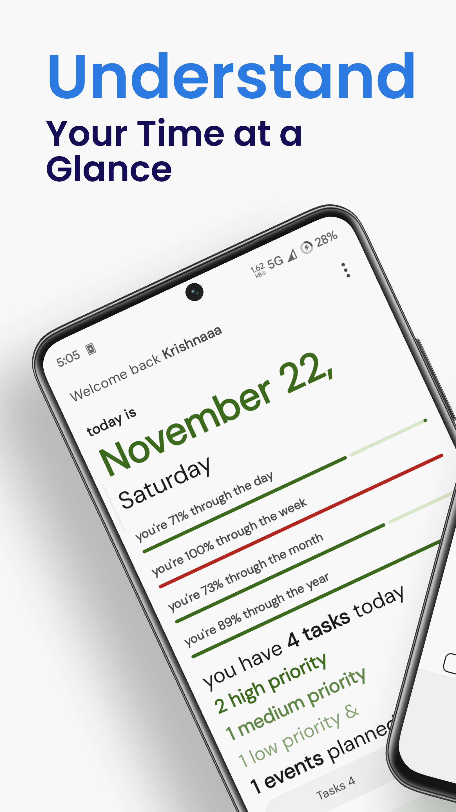
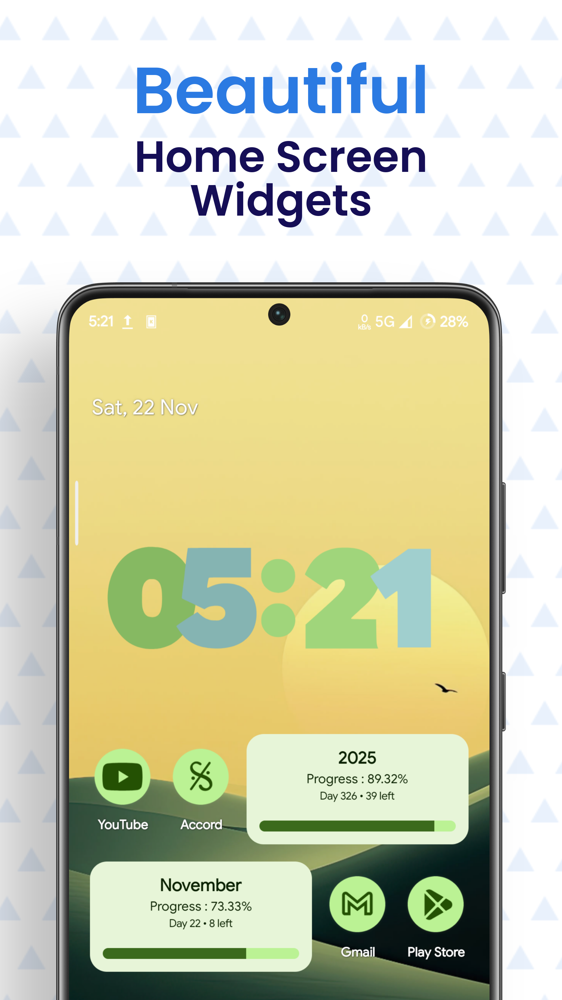
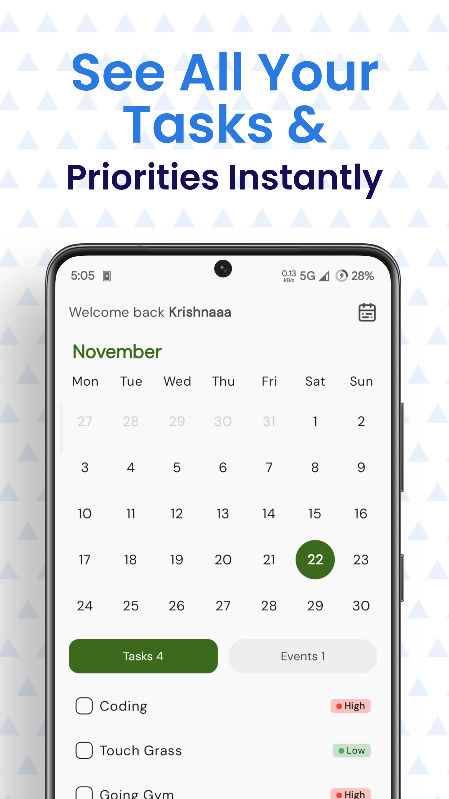
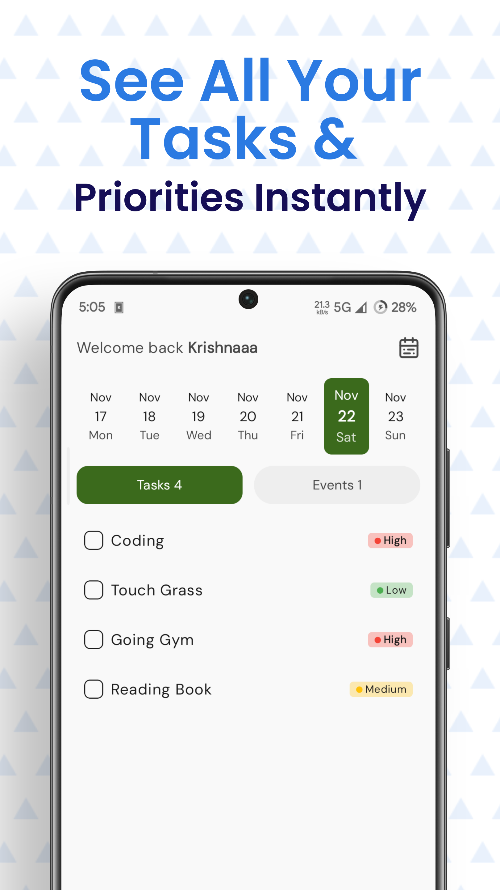
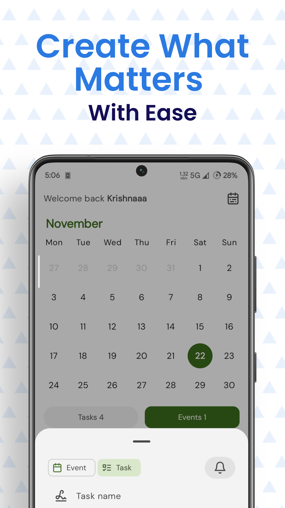
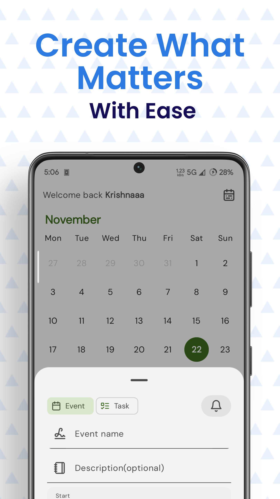
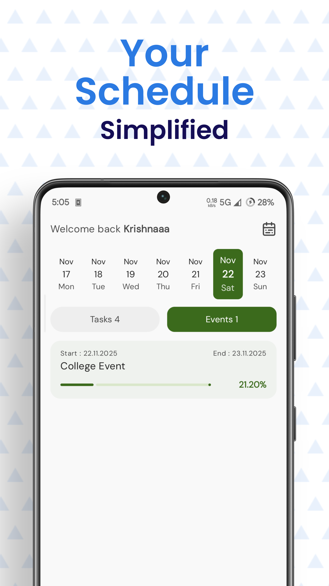
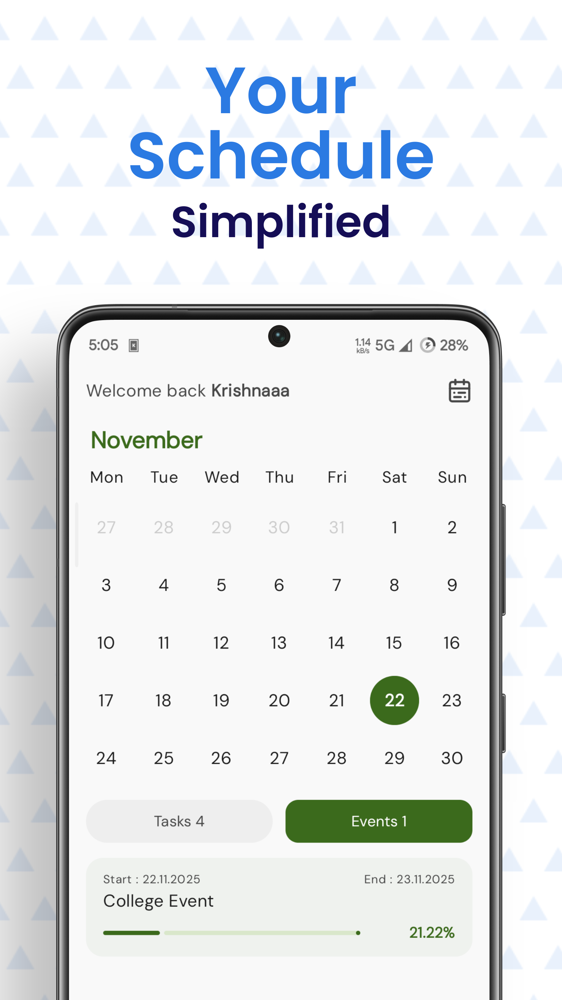
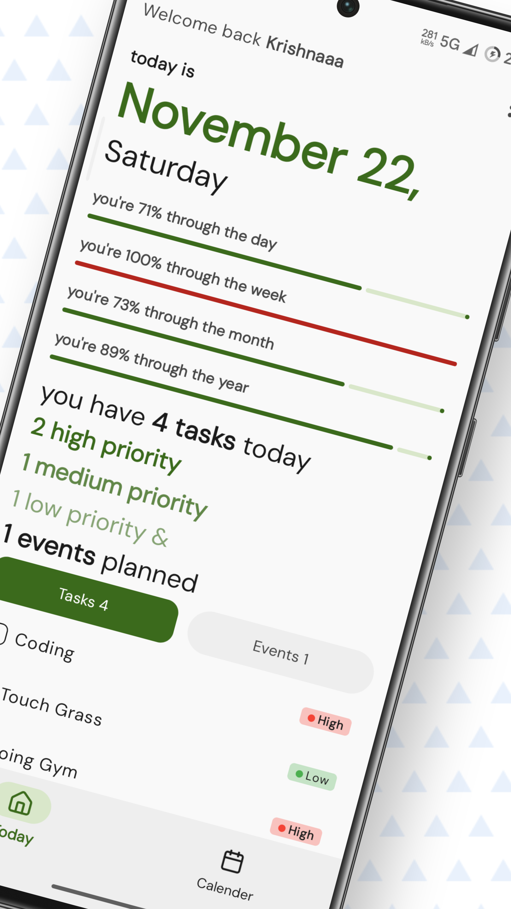
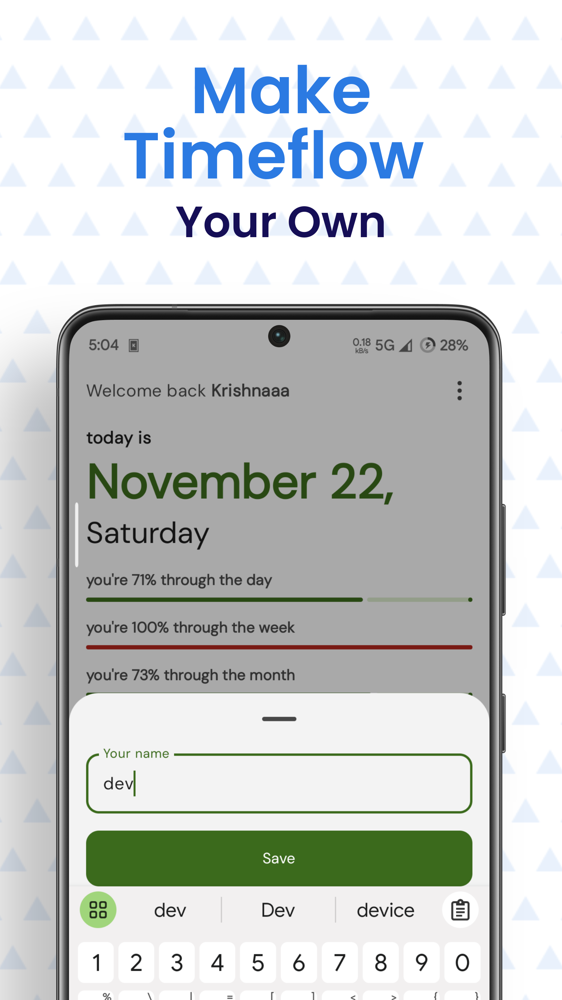

# ⏳ Time Flow

**Time Flow** is a modern **Material 3** based tracking application designed to help you to visualize how your time is spent across days, weeks,months & years 

> See the time slipping away — and make every moment count.

---

## Features

#### 📊 Progress Tracking

Visual Life Bars: Track the passage of your day, week, month, and year with elegant Material 3 progress bars. 

Home Screen Widgets: Keep your progress at a glance without ever opening the app.

<!--suppress ALL -->

#### 📅 Event & Task Management

Calendar View: Seamlessly add and manage tasks or life events in an intuitive calendar interface.

Smart Scheduling: Organize your timeline to ensure you’re meeting your long-term goals.

#### 🔔 Smart Notifications

Custom Timers: Set specific notification timers for your tasks so you never miss a deadline.

Timely Reminders: Get nudged exactly when you need to focus or transition to your next event.

## 📷 Screenshots

---

## 📲 How It Works

1. Install Time Flow from the Release.
2. Long-press your home screen and add the **Time Flow widget**.
3. Instantly see how far you are into your day, week, month, or year.
4. Get back to work with renewed awareness and drive.

---

## 🛠 Built With

- 💚 **Kotlin**
- 🧱 **Jetpack Compose**
- 📦 **Jetpack Glance** for widget rendering
- 📆 Android calendar and system time APIs

---

## 📄 License

This project is licensed under the **MIT License**.  
See the [LICENSE](LICENSE) file for more details.

---

## 🙌 Contributing

Contributions are welcome!  
If you find bugs or have ideas for improvements, open an issue or submit a pull request.

Start here 👉 [GitHub Issues](https://github.com/dev778g-me/time-flow/issues)

---

---

**Stay focused. Stay productive. Let your time flow.**

