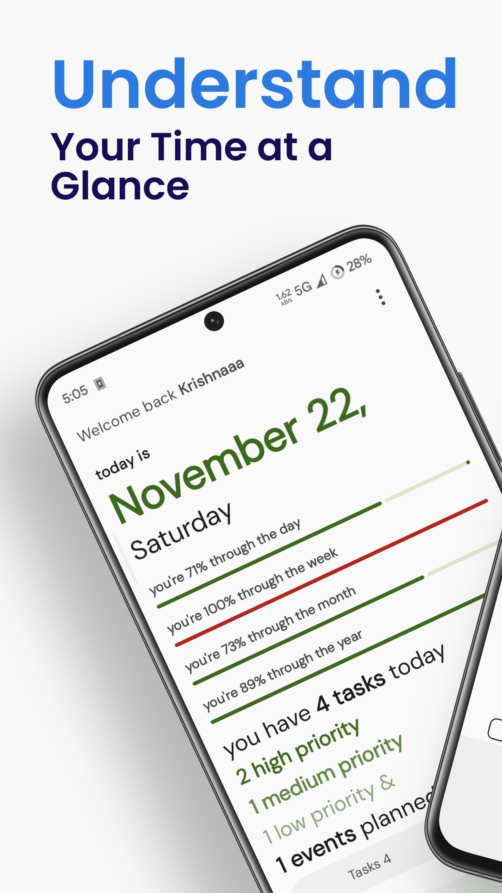
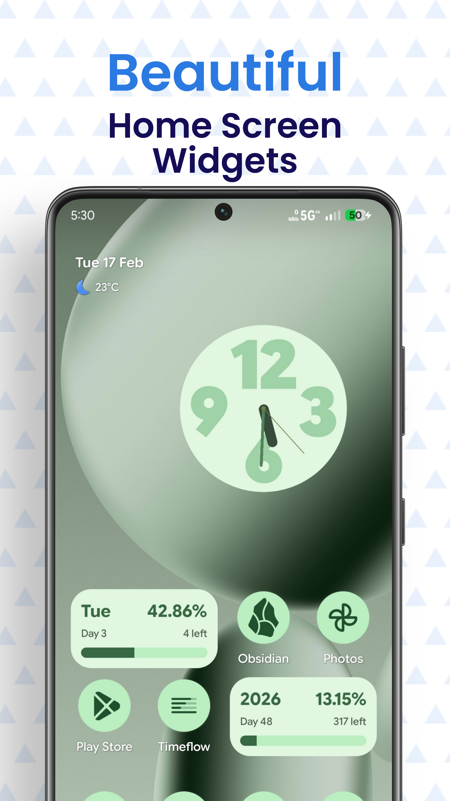
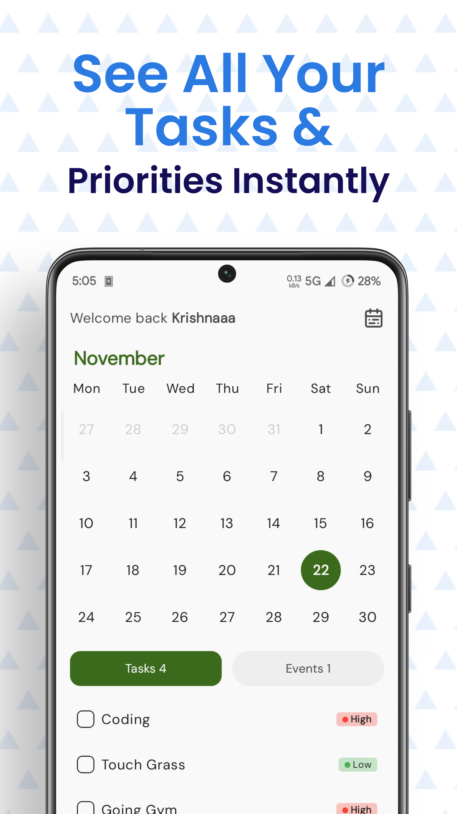
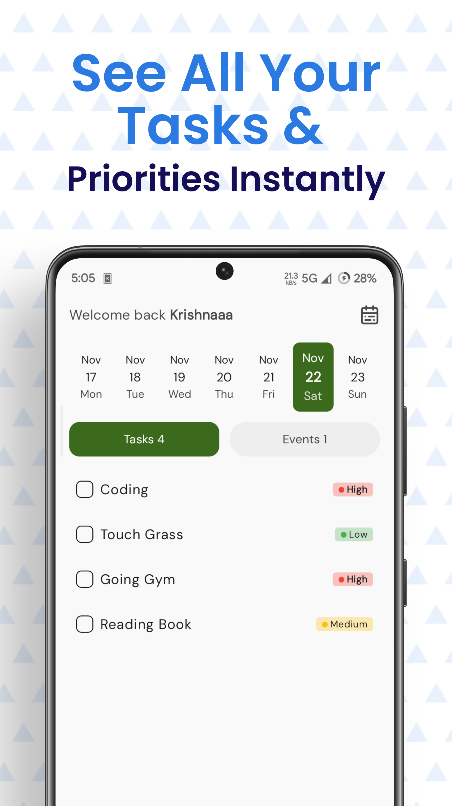
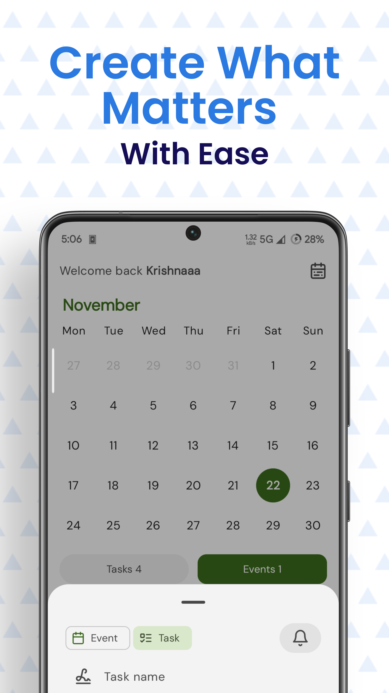
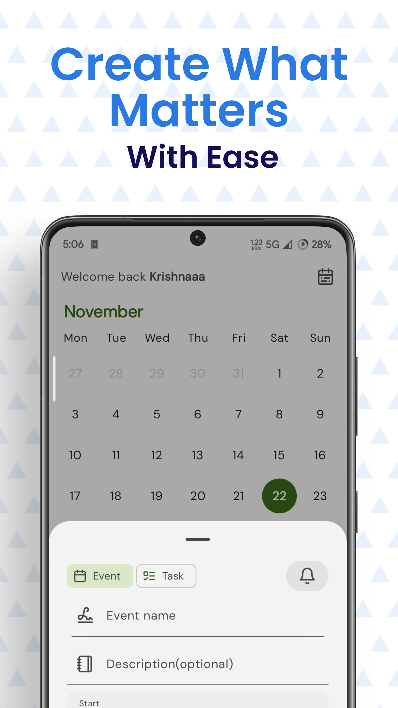
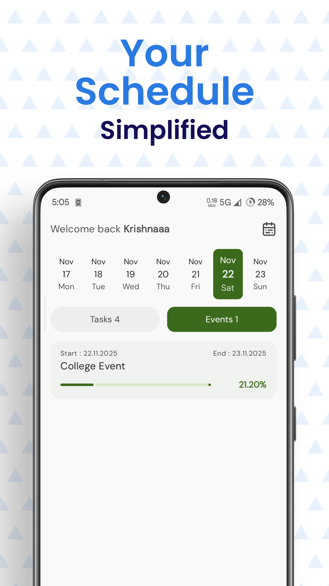
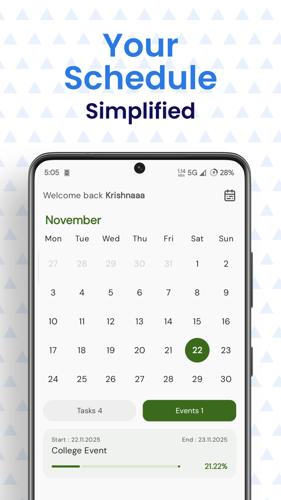

# ⏳ Time Flow

**Time Flow** is a simple, good-looking app that helps you see how your time moves through the day, week, month, and year.

## Features

#### 📊 Progress Tracking

**Life bars for your time:** Watch your day, week, month, and year fill up with clean, easy to read progress bars.

**Home screen widgets:** Check your progress right from your home screen without even opening the app. You can pin countdowns and events too, so the days left are always in sight.

<!--suppress ALL -->

#### 📅 Event & Task Management

**A calendar that keeps up with you:** Add tasks and life events in a simple calendar view and manage them all in one place.

**Plan ahead:** Lay out your schedule so it is easier to stay on track with your long-term goals.

**Countdowns for the days that matter:** Long-press any day on the calendar to start a countdown, and keep the big day close with a widget on your home screen.

#### 🔔 Smart Notifications

**Reminders that reach you in time:** Set timers for your tasks and get a nudge before a deadline or the start of your next event, so nothing slips by.

#### 🎨 Make It Yours

**Your app, your look:** Pick dark or light mode, take colors from your wallpaper, choose your own accent color, font, and even a pure black AMOLED mode. TimeFlow remembers your choices for next time.

## 📲 How It Works

1. Install Time Flow from the Releases page.
2. Long-press your home screen and add a Time Flow widget.
3. Instantly see how far you are into your day, week, month, or year.
4. Get back to work with renewed awareness and drive.

---

## 🛠 Built With

- Kotlin
- Jetpack Compose
- Jetpack Glance for the widgets
- Material 3

---

## 📄 License

This project is licensed under the **MIT License**.
See the [LICENSE](LICENSE) file for more details.

---

## 🙌 Contributing

Contributions are welcome!
If you find bugs or have ideas for improvements, open an issue or submit a pull request.

Start here: [GitHub Issues](https://github.com/dev778g-me/time-flow/issues)

---

---

**Stay focused. Stay productive. Let your time flow.**
